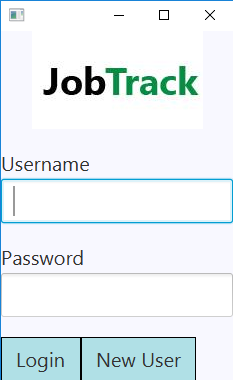
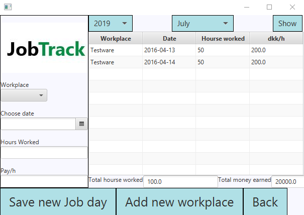

# JobTrack

A desktop application for keeping a track of worked hours for people who have multiple jobs. JobTrack allows to add unlimited ammount of work places
and count both worked hours and earned money. The application can hold more than one user account.  

## Technologies used

+ Java programming language
+ MySQL relational database management system (DBMS)

## Getting Started

In order to run the project a small amount of prerequisites and additional steps have to be fulfilled.

### Prerequisites

+ NetBeans IDE (or any other)
+ Database Management System

### Running

+ Run `jobtrackdb.sql` file in `Resources` folder for getting database schema and data
+ Run `Login.java` file and create you account or use a default account with credentials:
    - Username: `Edga`
    - Password: `Edga`
